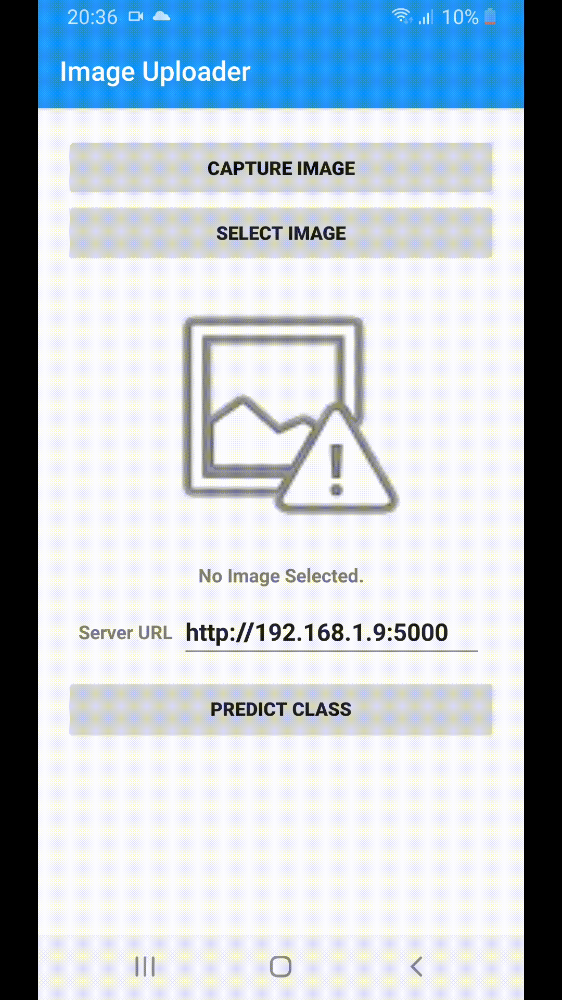

# AndroidFlask

## Image Upload from Android to a Python-Based Flask Server
The repository consists of 2 main folders:
1. **AndroidClient**: Represents the Android Studio project which builds an Android app working as a client. 
2. **FlaskServer**: The Python-Based server using Flask.



[Image Uploader APK](AndroidClient/app-release.apk)


[Android image classification app using keras model on flask server](https://codemaker2015.medium.com/eda31a94aa7c)


## Steps to run the project

* Open the **Android Studio** and import the project from the **AndroidClient** folder and run it to create the APK and run the app.
* Open terminal under **FlaskServer/app** folder.
* Create a virtual environment using the following command. Ensure that you have installed Python 3.7.x and added it's path in the environment variables.

[Installing packages using pip and virtual environments](https://packaging.python.org/guides/installing-using-pip-and-virtual-environments/)

```
python -m venv venv
```
* Switch to the virtual environment.

In Windows,
```
venv\Scripts\activate
```
In Ubuntu,
```
source venv/bin/activate
```
* Install the required packages using **requirements.txt**.
```python
pip install -r requirements.txt
```
* Run the **Flask** app Python file.
```python
python server.py
```
* After the server is up and running, then go back to the Android app. Edit the EditText box of the **Server URL** to reflect the current IPv4 address of the server with port number. Either put the IP address of the local machine or hosted VM address. Here we hosted the flask server on Heroku and you can put that url [https://androidflaskdemo.herokuapp.com](https://androidflaskdemo.herokuapp.com) as well.
* Eg: http://192.168.1.9:5000
* Select an image file to be uploaded to the server by clicking on the **Select Image** button. 
* NB: Copy images that available under `FlaskServer\FlaskServer\test_images` folder to your mobile device or make images with size (28, 28) because the model is trained only for these dimension of images.
* Click on the **Connect to Server** button to establish a connection with the server and upload the selected image.
